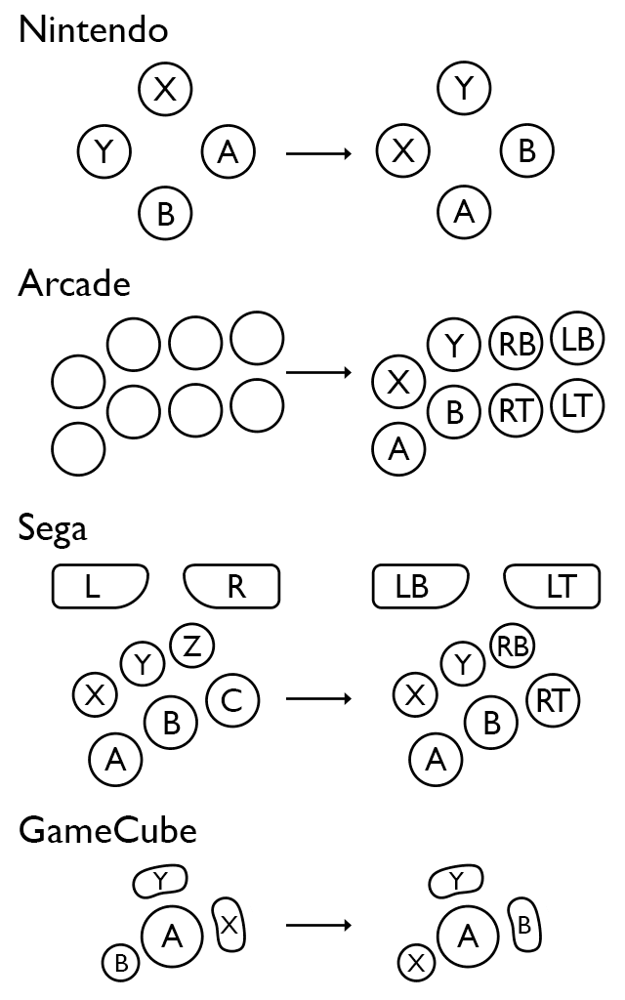

# SDL_GameControllerDB

A community sourced database of game controller mappings to be used with SDL2 and SDL3 Game Controller functionality.

## Usage
Download gamecontrollerdb.txt, place it in your app's directory and load it.

SDL2:
```c
SDL_GameControllerAddMappingsFromFile("gamecontrollerdb.txt");
```

SDL3:
```c
SDL_AddGamepadMappingsFromFile("gamecontrollerdb.txt");
```

The database is compatible with SDL v2.0.10 and newer.

## Create New Mappings
A mapping looks like this:
```
030000004c050000c405000000010000,PS4 Controller,a:b1,b:b2,back:b8,dpdown:h0.4,dpleft:h0.8,dpright:h0.2,dpup:h0.1,guide:b12,leftshoulder:b4,leftstick:b10,lefttrigger:a3,leftx:a0,lefty:a1,rightshoulder:b5,rightstick:b11,righttrigger:a4,rightx:a2,righty:a5,start:b9,x:b0,y:b3,platform:Mac OS X,
```
It includes controller GUID (`030000004c050000c405000000010000`), a name (`PS4 Controller`), button / axis mappings (`leftshoulder:b4`) and a platform (`platform:Mac OS X`).

Please make sure to check that the name is a good description of the controller. If relevant, include the controller's name and model number.

## Mapping Guide



## Mapping Tools
There are a few different tools that let you create mappings.

### [SDL2 Gamepad Tool](http://www.generalarcade.com/gamepadtool/)
Third party cross-platform tool with GUI (Windows, macOS and Linux)

*While convenient, this tool has fallen out of date as SDL has amended and added new features for gamepad support (see [#478](https://github.com/gabomdq/SDL_GameControllerDB/issues/476)). Maps authored with this tool require maintainer scrutiny to ensure they will not break support for explicit mappings the SDL project provides.*

### [SDL](https://github.com/libsdl-org/SDL/releases/latest)
[testcontroller (SDL3)](https://github.com/libsdl-org/SDL/blob/main/test/testcontroller.c) and [controllermap (SDL2)](https://github.com/libsdl-org/SDL/blob/SDL2/test/controllermap.c) utilities are the official tools to create these mappings on all SDL supported platforms (Windows, Mac, Linux, iOS, Android, etc).

## Contributing

First, please confirm for yourself
- Your device is a gamepad
- Your mapping best represents the Xbox layout per the [mapping guide](https://github.com/mdqinc/SDL_GameControllerDB/blob/master/mapping_guide.png)
- An acceptable mapping is not [already present in the DB](https://github.com/mdqinc/SDL_GameControllerDB/blob/master/gamecontrollerdb.txt), searching by platform and GUID
- Adding the mapping to the db improves, and does not degrade, the experience of using the gamepad

Contribute by [opening a pull request](https://docs.github.com/en/pull-requests/collaborating-with-pull-requests/proposing-changes-to-your-work-with-pull-requests/creating-a-pull-request), or [creating an issue](https://github.com/mdqinc/SDL_GameControllerDB/issues/new)

## Resources

### [SDL2](https://wiki.libsdl.org/SDL2/)
* [Game Controller Support](https://wiki.libsdl.org/SDL2/CategoryGameController)
* [SDL_GameControllerAddMappingsFromFile](https://wiki.libsdl.org/SDL2/SDL_GameControllerAddMappingsFromFile)
### [SDL3](https://wiki.libsdl.org/SDL3/)
* [Gamepad Support](https://wiki.libsdl.org/SDL3/CategoryGamepad)
* [SDL_AddGamepadMappingsFromFile](https://wiki.libsdl.org/SDL3/SDL_AddGamepadMappingsFromFile)
